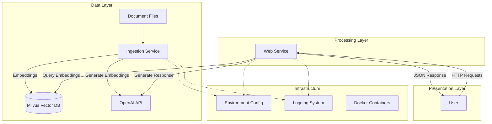
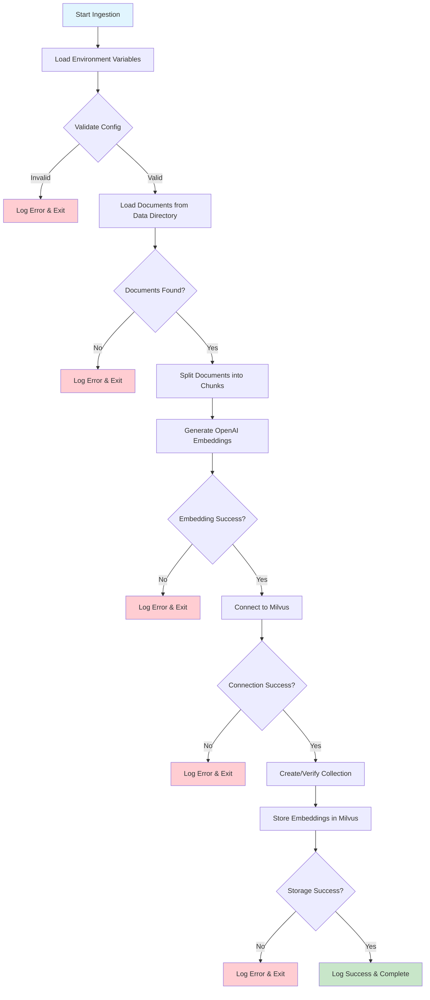
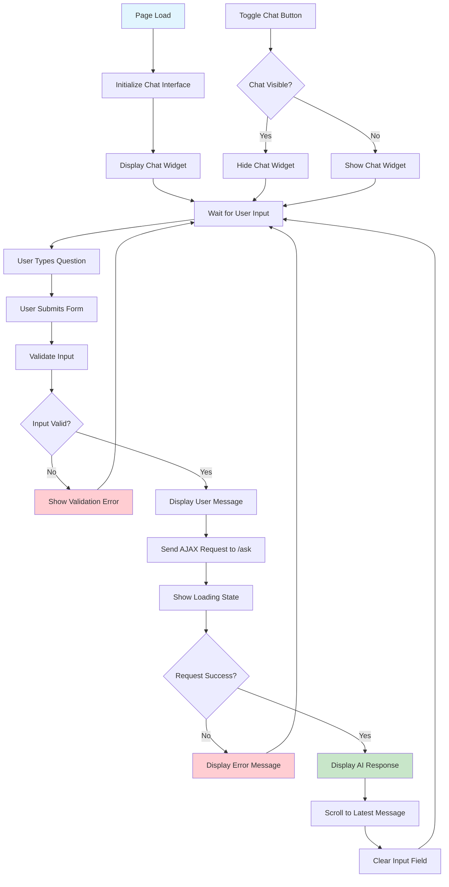
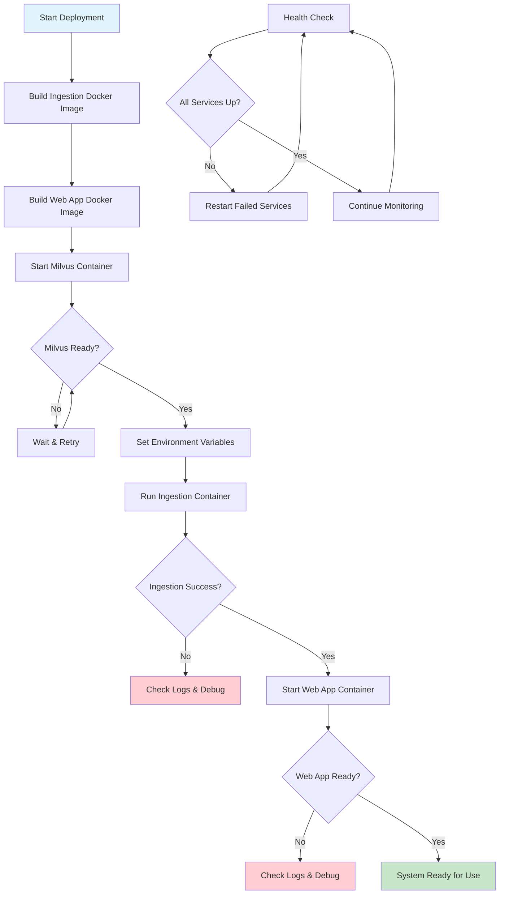

# Design Document

## Overview

The Milvus-OpenAI RAG system is designed as a microservices architecture with two primary components: an ingestion service for document processing and embedding generation, and a web application service for conversational retrieval. The system leverages OpenAI's embedding and language models for semantic understanding, while using Milvus as a high-performance vector database for similarity search.

The architecture follows a clear separation of concerns with the ingestion pipeline handling batch processing of documents and the web service managing real-time user interactions. Both services share common configuration patterns and error handling strategies while maintaining independent deployment capabilities.

## Architecture

### High-Level Architecture



### System Workflow Diagrams

#### Document Ingestion Workflow



#### Conversational Retrieval Workflow

```mermaid
flowchart TD
    A[User Submits Question] --> B[Validate Input]
    B --> C{Input Valid?}
    C -->|No| D[Return Error Response]
    C -->|Yes| E{Special Command?}
    E -->|Thank You| F[Return Welcome Response]
    E -->|Goodbye| G[Return Goodbye Response]
    E -->|No| H[Load Conversation Memory]
    H --> I[Reformulate Question with Context]
    I --> J[Query Milvus for Similar Documents]
    J --> K{Documents Found?}
    K -->|No| L[Return "I am sorry" Response]
    K -->|Yes| M[Retrieve Top 5 Similar Chunks]
    M --> N[Generate Response with OpenAI LLM]
    N --> O{Generation Success?}
    O -->|No| P[Return Generic Error]
    O -->|Yes| Q[Update Conversation Memory]
    Q --> R[Return AI Response]
    R --> S[Log Token Usage & Cost]
    
    style A fill:#e1f5fe
    style F fill:#c8e6c9
    style G fill:#c8e6c9
    style R fill:#c8e6c9
    style D fill:#ffcdd2
    style L fill:#fff3e0
    style P fill:#ffcdd2
```

#### Frontend Chat Interface Workflow



#### Docker Deployment Workflow



### Component Architecture

The system consists of three main components:

1. **Ingestion Service** (`ingestion/`)
   - Document loading and preprocessing
   - Text chunking and embedding generation
   - Vector storage in Milvus
   - Collection management utilities

2. **Web Application Service** (`web-app/`)
   - Flask-based REST API
   - Conversational retrieval chain
   - Memory management for chat history
   - Frontend chat interface

3. **Shared Infrastructure**
   - Environment configuration management
   - Logging and error handling
   - Docker containerization
   - Milvus database connection

## Components and Interfaces

### Ingestion Service Components

#### Document Loader
- **Purpose**: Load text documents from the data directory
- **Interface**: `load_docs(directory_path: str) -> List[Document]`
- **Dependencies**: LangChain DirectoryLoader
- **Error Handling**: Returns empty list on failure, logs errors

#### Text Splitter
- **Purpose**: Split documents into manageable chunks for embedding
- **Interface**: `split_docs(documents: List[Document], chunk_size: int, chunk_overlap: int) -> List[Document]`
- **Configuration**: Default 500 characters with 20 character overlap
- **Strategy**: Recursive character splitting to maintain context

#### Embedding Storage
- **Purpose**: Generate embeddings and store in Milvus
- **Interface**: `store_embeddings_in_milvus(docs: List[Document]) -> None`
- **Dependencies**: OpenAI Embeddings, Milvus vector store
- **Configuration**: Uses IP (Inner Product) similarity metric

#### Collection Manager
- **Purpose**: Manage Milvus collections (create, drop, check existence)
- **Interface**: `drop_collection() -> None`
- **Dependencies**: PyMilvus direct connection
- **Safety**: Checks collection existence before operations

### Web Application Components

#### Flask Application
- **Purpose**: HTTP server for handling user requests
- **Routes**: 
  - `GET /` - Serve chat interface
  - `POST /ask` - Process user questions
- **Configuration**: Debug mode enabled for development
- **Error Handling**: JSON error responses with appropriate HTTP status codes

#### Conversational Retrieval Chain
- **Purpose**: Orchestrate the RAG pipeline
- **Components**:
  - OpenAI LLM (temperature: 0.7)
  - Milvus vector retriever (k=5 similar documents)
  - Conversation memory buffer (k=5 interactions)
  - Custom prompt template for question reformulation
- **Chain Type**: "stuff" - concatenates retrieved documents

#### Memory Management
- **Type**: ConversationBufferWindowMemory
- **Configuration**: Maintains last 5 chat interactions
- **Purpose**: Provide conversation context for follow-up questions
- **Memory Key**: "chat_history"

#### Frontend Interface
- **Technology**: HTML5, CSS3, Vanilla JavaScript
- **Features**:
  - Floating chat widget
  - Toggle visibility
  - Real-time message display
  - Form submission handling
  - Error display

### Shared Components

#### Configuration Manager
- **Purpose**: Load and validate environment variables
- **Required Variables**:
  - `OPENAI_API_KEY`
  - `MILVUS_HOST`, `MILVUS_PORT`, `MILVUS_ALIAS`
  - `MILVUS_VECTOR_COLLECTION_NAME`
- **Support**: .env file loading for development
- **Validation**: Exits application if required variables missing

#### Logging System
- **Level**: INFO for normal operations
- **Format**: Standard Python logging with timestamps
- **Scope**: All components use centralized logging
- **Error Tracking**: Detailed error messages with context

## Data Models

### Document Model
```python
class Document:
    page_content: str  # Text content of the document chunk
    metadata: dict     # File path, chunk index, source information
```

### Embedding Vector
```python
class EmbeddingVector:
    vector: List[float]    # 1536-dimensional OpenAI embedding
    document_id: str       # Unique identifier for the source document
    metadata: dict         # Associated document metadata
```

### Chat Message
```python
class ChatMessage:
    role: str             # "user" or "assistant"
    content: str          # Message text
    timestamp: datetime   # When message was created
```

### Conversation Memory
```python
class ConversationMemory:
    chat_history: List[ChatMessage]  # Last 5 interactions
    memory_key: str                  # "chat_history"
    return_messages: bool            # True for message objects
```

### Configuration Model
```python
class SystemConfig:
    openai_api_key: str
    milvus_host: str
    milvus_port: int
    milvus_alias: str
    milvus_collection_name: str
```

## Error Handling

### Ingestion Service Error Handling

#### Document Loading Errors
- **Scenario**: Directory not found, permission issues, unsupported file formats
- **Response**: Log error, return empty document list, continue processing
- **Recovery**: Skip problematic files, process remaining documents

#### Embedding Generation Errors
- **Scenario**: OpenAI API failures, rate limiting, network issues
- **Response**: Log detailed error with context, exit application
- **Prevention**: Validate API key before processing, implement retry logic

#### Milvus Connection Errors
- **Scenario**: Database unavailable, collection creation failures, permission issues
- **Response**: Log connection details, exit with error code
- **Recovery**: Provide clear error messages for troubleshooting

### Web Application Error Handling

#### API Request Errors
- **Scenario**: Malformed JSON, missing question parameter
- **Response**: Return JSON error with 400 status code
- **Message**: "Please enter your question."

#### Retrieval Chain Errors
- **Scenario**: OpenAI API failures, Milvus query errors, memory issues
- **Response**: Return generic error message to user, log detailed error
- **Message**: "An error occurred while processing your question."

#### Frontend Error Handling
- **Scenario**: Network failures, server errors, JavaScript exceptions
- **Response**: Display "An error occurred" message in chat
- **Logging**: Console error logging for debugging

### Global Error Handling Patterns

#### Environment Validation
- **Check**: All required environment variables present
- **Action**: Exit with error code 1 if validation fails
- **Logging**: Specific missing variable information

#### Graceful Degradation
- **Principle**: System continues operating when non-critical components fail
- **Implementation**: Skip failed documents, continue processing others
- **User Experience**: Provide feedback about partial failures

## Testing Strategy

### Unit Testing

#### Ingestion Service Tests
- **Document Loading**: Test with various file types, empty directories, permission issues
- **Text Splitting**: Verify chunk sizes, overlap behavior, edge cases
- **Embedding Storage**: Mock OpenAI and Milvus interactions, test error scenarios
- **Configuration**: Test environment variable validation, .env file loading

#### Web Application Tests
- **Route Testing**: Test GET and POST endpoints with various inputs
- **Retrieval Chain**: Mock dependencies, test conversation flow
- **Memory Management**: Verify conversation history limits, context preservation
- **Error Handling**: Test all error scenarios and response formats

### Integration Testing

#### End-to-End Workflow
- **Ingestion to Retrieval**: Ingest test documents, verify retrieval accuracy
- **Conversation Flow**: Test multi-turn conversations with context preservation
- **Database Operations**: Test collection creation, document storage, similarity search

#### External Service Integration
- **OpenAI API**: Test embedding generation and language model responses
- **Milvus Database**: Test connection, collection operations, vector search
- **Environment Configuration**: Test various deployment configurations

### Performance Testing

#### Load Testing
- **Concurrent Users**: Test multiple simultaneous chat sessions
- **Large Document Sets**: Test ingestion performance with large document collections
- **Memory Usage**: Monitor conversation memory and system resource usage

#### Scalability Testing
- **Vector Database**: Test search performance with increasing document count
- **Response Time**: Measure end-to-end response times under load
- **Resource Utilization**: Monitor CPU, memory, and network usage

### Docker Testing

#### Container Testing
- **Build Process**: Verify Docker images build successfully
- **Environment Variables**: Test container startup with various configurations
- **Volume Mounting**: Test data directory mounting for ingestion service
- **Network Connectivity**: Test inter-container communication

#### Deployment Testing
- **Multi-Environment**: Test deployment across development, staging, production
- **Configuration Management**: Test environment-specific configurations
- **Health Checks**: Implement and test container health monitoring